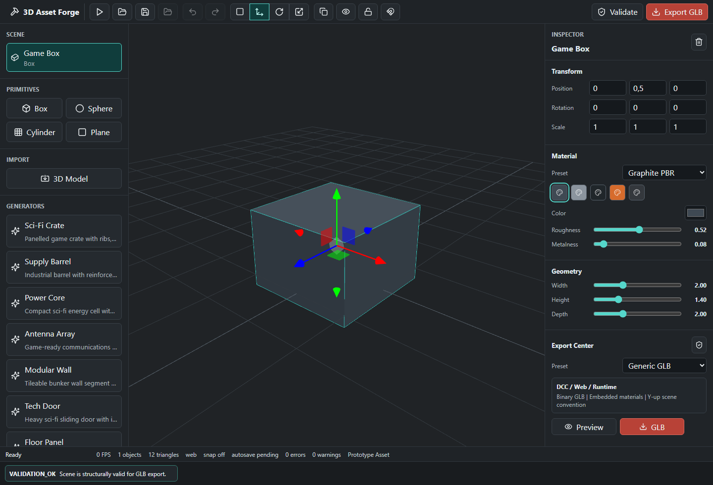
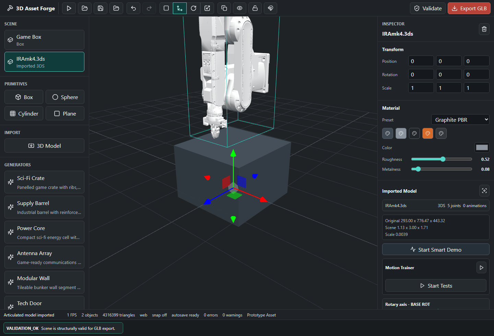
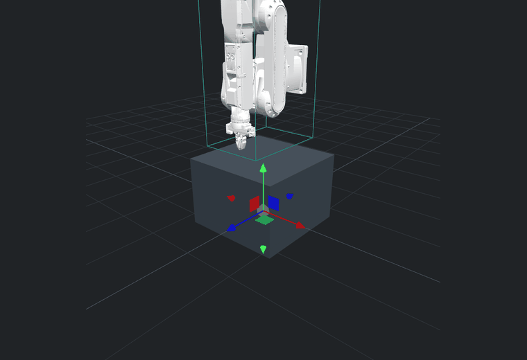
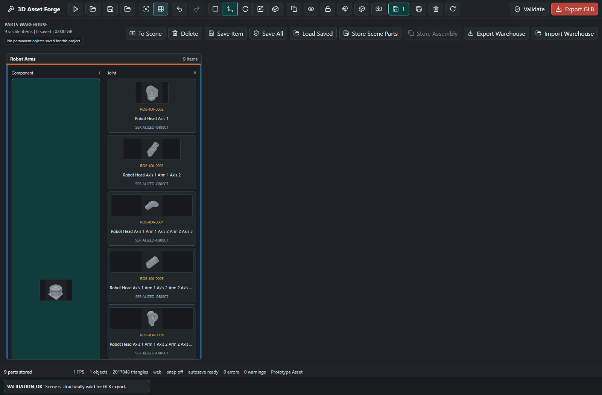
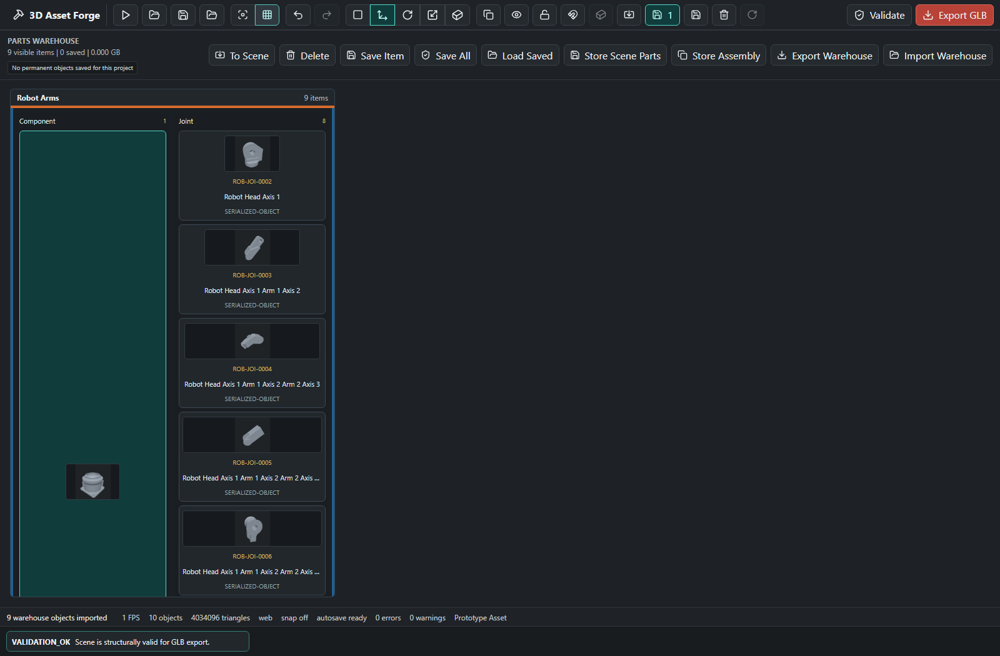

# 3D Asset Forge

Plataforma profesional en JavaScript para crear, importar, validar, articular y exportar objetos 3D preparados para motores en tiempo real.



## Objetivo

3D Asset Forge es un entorno de trabajo 3D centrado en la preparacion practica de assets. La plataforma combina generacion procedural, importacion de modelos, ajuste inteligente de escala, deteccion de articulaciones, validacion de movimientos y exportacion GLB en un unico flujo.

El objetivo principal es reducir el trabajo manual necesario para preparar modelos 3D descargados, mecanicos, roboticos, vehiculares o de simulacion. La plataforma busca detectar pivotes, ejes y articulaciones, permitir validar como debe moverse cada pieza y guardar ese aprendizaje para futuras demos o exportaciones.

## Capacidades Actuales

- Generadores procedurales de objetos hard-surface listos para prototipos.
- Importacion directa de `.glb`, `.fbx`, `.dae`, `.obj` y `.3ds`.
- Mensajes claros para formatos propietarios que requieren conversion previa: `.blend`, `.c4d`, `.max`, `.sldprt` y `.sldasm`.
- Ajuste inteligente de escala para modelos demasiado grandes o desplazados.
- Deteccion de articulaciones a partir de nombres, pivotes, huesos y jerarquias importadas.
- Reconstruccion mecanica para modelos `.3ds` donde los pivotes y las mallas visibles llegan como objetos planos.
- Controles logicos por articulacion: `Rotate X/Y/Z` o `Slide X/Y/Z`.
- Motion Trainer para validar movimientos test por test.
- Demo aprendida basada solo en movimientos validados y ordenados por el usuario.
- Warehouse de piezas con dashboard separado, categorias, clases y miniaturas reales.
- Guardado fisico de piezas y conjuntos como `.glb` dentro de `project-warehouse/<projectId>/`.
- Guardado permanente de cambios del workspace: color, transformaciones, copias y objetos importados.
- Borrado permanente desde workspace o warehouse, eliminando tambien el fichero local asociado.
- Preflight de exportacion y perfiles GLB para uso generico, Unity, Unreal y Godot.
- Modo navegador y base Tauri para aplicacion de escritorio.

## Plataforma En Accion

### Modelo Articulado Importado

La plataforma normaliza modelos grandes, detecta articulaciones mecanicas y muestra controles especificos en el inspector.



### Motion Trainer

Motion Trainer lanza pruebas de movimiento una por una. El usuario valida o rechaza cada movimiento candidato para ensenar a la plataforma como debe moverse ese modelo concreto.


### Secuencia De Movimiento Aprendida

Los movimientos validados se guardan, se muestran en una lista y se pueden ordenar. La demo automatica usa esa secuencia aprendida en lugar de aplicar movimientos genericos.


### Demo Animada

La demo aprendida aplica movimiento sobre la escena Three.js ya cargada, evitando recargar modelos pesados durante la reproduccion.



### Desmantelado En Piezas

Un modelo robotico importado puede separarse en piezas reutilizables. Cada pieza queda clasificada por categoria y clase dentro del warehouse, con miniatura real generada desde la escena.



### Reconstruccion En Workspace

Las piezas guardadas pueden volver al escenario como objetos independientes. Esto permite reconstruir conjuntos, modificar piezas sueltas, crear variantes y guardar nuevas versiones.


### Modelo Robotico Importado

El flujo empieza con modelos reales importados, no con placeholders. La plataforma mantiene la visualizacion del asset completo mientras permite extraer piezas y convertirlas en componentes reutilizables.


## Casos De Uso Y Valor

3D Asset Forge esta pensada para convertir modelos 3D complejos en una libreria reutilizable de componentes. Esto reduce tiempo de preparacion, evita rehacer piezas y permite crear variantes comerciales a partir de assets existentes.

Casos de uso principales:

- Preparacion de catalogos 3D: desmontar modelos de vehiculos, brazos roboticos, maquinaria o productos y guardar piezas independientes con miniaturas.
- Reutilizacion de componentes: extraer bases, articulaciones, ruedas, paneles, brazos o pinzas para crear nuevos conjuntos sin volver al modelo original.
- Prototipado industrial: importar piezas guardadas al workspace, combinarlas y guardar conjuntos como assemblies reutilizables.
- Variantes de producto: cambiar color, escala o posicion de una pieza y guardarla como nuevo GLB permanente.
- Control de inventario visual: revisar categorias, clases, codigos, peso del warehouse y previews antes de importar una pieza.
- Pipeline comercial: preparar assets limpios para GLB, Unity, Unreal, Godot, web viewers, configuradores y demos de producto.



## Como Funciona

Manual operativo separado:

- [Manual de uso: warehouse, piezas y workspace](docs/manual-uso-warehouse.md)

### 1. Crear O Importar

El usuario puede crear objetos procedurales desde el panel de generadores o importar un modelo existente. El modelo importado queda embebido dentro del documento del proyecto como data URL, por lo que puede guardarse y restaurarse sin depender de rutas externas.

Formatos soportados directamente:

| Formato | Extension | Notas |
| --- | --- | --- |
| glTF Binary | `.glb` | Formato recomendado para intercambio moderno |
| FBX | `.fbx` | Comun en pipelines de animacion y videojuegos |
| Collada | `.dae` | Util en flujos DCC antiguos |
| OBJ | `.obj` | Importacion de mallas estaticas |
| 3DS | `.3ds` | Soportado con reconstruccion de jerarquia mecanica |

### 2. Normalizar Escala

Muchos modelos descargados o exportados desde CAD llegan con escalas enormes, muy pequenas o desplazados del suelo. El importador calcula limites originales, limites normalizados, escala de importacion y offset. El resultado queda ajustado a una escena practica sin destruir los datos originales.

### 3. Detectar Articulaciones

La plataforma analiza objetos, huesos y nombres para inferir comportamiento mecanico:

- ruedas y neumaticos se convierten en controles rotativos;
- puertas y paneles se tratan como bisagras;
- brazos, munecas, cabezales y ejes se tratan como articulaciones rotativas;
- railes, pistones y piezas telescopicas se tratan como desplazamientos lineales;
- huesos de esqueleto se tratan como articulaciones de rig.

En modelos `.3ds` como `IRAmk4.3ds`, la plataforma reconstruye una jerarquia mecanica agrupando mallas visibles bajo pivotes detectados como `BASE_ROT`, `ARM_1`, `ARM_2`, `HEAD_ST` y `HEAD_ND`.

### 4. Controlar Movimiento De Forma Logica

El inspector muestra un unico control logico por articulacion. Una base rotatoria usa `Rotate Y`; un actuador lineal usa `Slide X/Y/Z`; una rueda usa un eje rotativo. Esto evita movimientos sin sentido, como desplazar verticalmente una pieza que realmente debe rotar.

### 5. Entrenar Movimiento Especifico Del Modelo

Motion Trainer genera candidatos para cada articulacion detectada. El flujo es:

1. Pulsar `Start Tests`.
2. Observar el movimiento candidato actual.
3. Pulsar `Validate` si el movimiento es correcto.
4. Pulsar `Reject` si no tiene sentido.
5. Repetir hasta construir el mapa de movimiento del modelo.
6. Ordenar los movimientos validados con las flechas.
7. Pulsar `Start Learned Demo` para reproducir la secuencia aprendida.

Los datos aprendidos se guardan en el documento como `validatedMotions`, incluyendo articulacion, tipo de movimiento, eje, limites, amplitud y orden.

### 6. Guardar Piezas En Warehouse

El warehouse permite convertir piezas desmontadas o conjuntos creados en el escenario en objetos 3D independientes. Las piezas permanentes se guardan como `.glb` fisicos en el proyecto local y se indexan en `manifest.json`.

Flujo principal:

1. Importar un modelo con `3D Model`.
2. Pulsar `Dismantle selected model into warehouse`.
3. Abrir `Warehouse dashboard`.
4. Pulsar `Save All`.
5. Refrescar la pagina.
6. Pulsar `Load Saved`.
7. Importar una pieza con `Import saved warehouse object to workspace`.

Si se modifica una pieza en el workspace, el boton `Save workspace changes permanently` se activa y guarda fisicamente esos cambios. Las miniaturas del warehouse se guardan tambien en el manifest para que despues del refresh no aparezca el icono generico.

Los detalles completos estan en:

- [Manual de uso: warehouse, piezas y workspace](docs/manual-uso-warehouse.md)

## Estrategia De Rendimiento

La plataforma esta optimizada para evitar recargas innecesarias:

- los modelos importados se cachean despues del parseo;
- la geometria pesada no se reconstruye cuando solo cambia una pose;
- los sliders manuales aplican transformaciones directamente sobre objetos Three.js ya cargados;
- la demo automatica corre dentro del render loop;
- cambios de seleccion, herramienta o snap no fuerzan una reconstruccion completa;
- se guardan rotaciones y posiciones base para aplicar cada movimiento desde un estado estable.

Esto es clave para modelos densos como `IRAmk4.3ds`, que contiene millones de triangulos.

## Estructura Del Proyecto

```text
src/
  application/          Perfiles de exportacion, validacion y flujos de proyecto
  domain/               Tipos principales, factories y generadores procedurales
  infrastructure/       Importadores, escena Three.js, exportacion GLB y storage
  presentation/         UI React, inspector, viewport y controles del editor
src-tauri/              Base para aplicacion de escritorio
docs/readme-assets/     Capturas y animaciones usadas por este README
project-warehouse/      Almacen local de piezas GLB permanentes en desarrollo
```

## Lanzar El Proyecto

Instalar dependencias:

```bash
npm install
```

En Windows PowerShell, si `npm` queda bloqueado por `npm.ps1`, usar:

```powershell
npm.cmd install
```

Arrancar el servidor de desarrollo:

```bash
npm run dev -- --port 5187 --strictPort
```

En Windows PowerShell:

```powershell
npm.cmd run dev -- --port 5187 --strictPort
```

Copiar solo el comando, no el prefijo del terminal. Por ejemplo, no copiar `PS C:\...\3D Asset Platform>`.

Si el puerto esta ocupado por una instancia anterior de la misma plataforma, usar:

```powershell
npm.cmd run dev:fresh -- --port 5187
```

Este comando cierra el servidor Vite anterior del proyecto y lo vuelve a abrir en el mismo puerto.

Abrir en el navegador:

```text
http://127.0.0.1:5187
```

Construir version de produccion:

```bash
npm run build
```

En Windows PowerShell:

```powershell
npm.cmd run build
```

Previsualizar la build:

```bash
npm run preview
```

## Modo Escritorio

El proyecto incluye una base Tauri para empaquetado de escritorio:

```bash
npm run desktop:dev
npm run desktop:build
```

La version de escritorio requiere tener instalado Rust/Tauri. El flujo en navegador funciona sin Rust.

## Assets Del README

Todas las imagenes y animaciones del README estan en:

```text
docs/readme-assets/
```

Assets actuales:

- `platform-overview.png`
- `imported-iramk4-inspector.png`
- `imported-iramk4-viewport.png`
- `motion-trainer-test.png`
- `learned-motion-sequence.png`
- `learned-motion-demo.gif`

## Estado De Validacion

Comandos principales de validacion:

```bash
npm run build
npm run test:render
npm run test:parts
```

El aviso de bundle grande es esperado porque la aplicacion incluye Three.js y varios loaders 3D. No bloquea la build de produccion.
